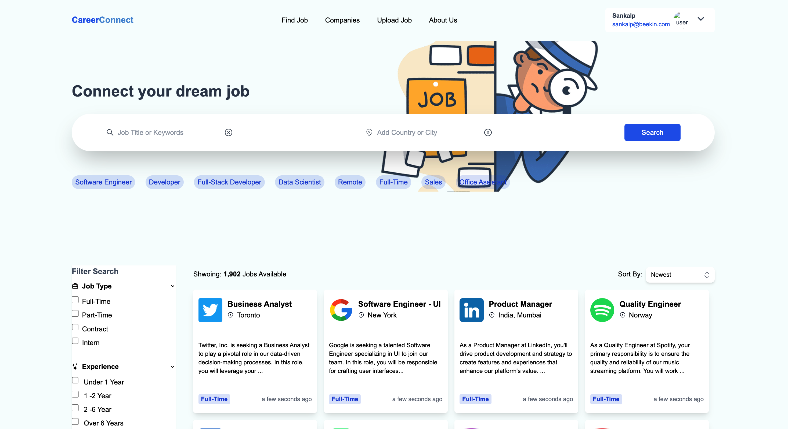
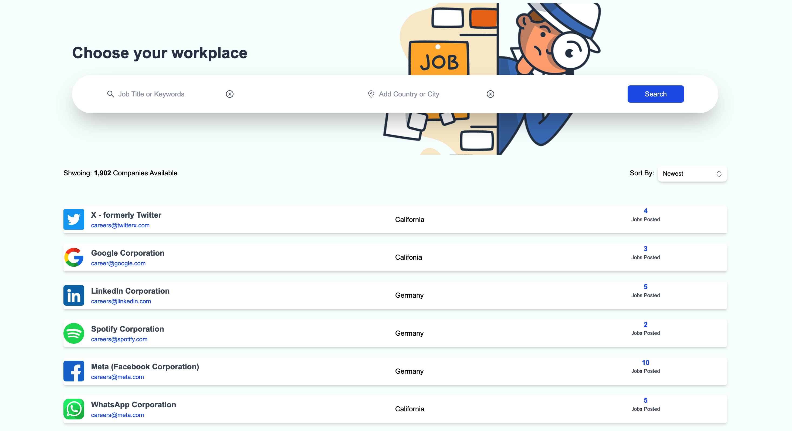
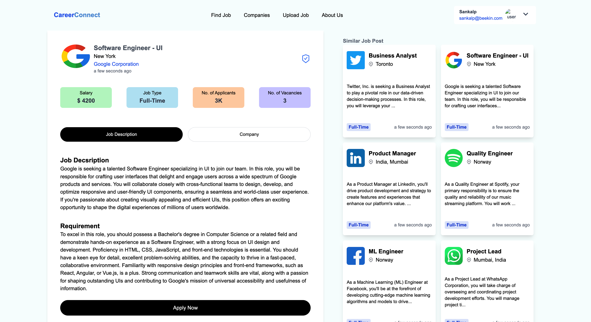

# JobSearch: The Ultimate Job Portal

Welcome to JobSearch, your ultimate job portal designed to streamline the job search and application process. This repository contains the source code for the JobSearch project. Please refer to this README for project details and instructions.

## Project Overview
JobSearch aims to solve one of the major challenges in the hiring process for companies - verifying candidates' qualifications and facilitating the job application process. This project consists of a backend service that provides job listings and allows users to apply for jobs, along with a frontend interface that enables users to browse and interact with job openings.

## Features
- User-friendly job listings with detailed job information.
- User registration and authentication.
- Job application functionality.
- Database storage for job listings and user information.

## Technologies Used
### Frontend (Client)
- ReactJS
- Tailwind CSS
- Headless UI
- Redux
- React Icons
- Moment
- Vite - Starter App

### Backend (Server)
- Node.js
- Express.js
- MongoDB
- Postman
- Cloudinary

## The Dashboard

## Getting Started

To get started with the JobSearch project, follow these steps:

#### Clone the Repository: Start by cloning this repository to your local machine.
   git clone https://github.com/yourusername/jobsearch.git

#### Frontend Setup:
cd client

##### Install the client dependencies using npm:
npm install

##### Run the client application:
npm run dev

- The frontend of JobSearch is built using ReactJS, styled with Tailwind CSS, and uses libraries like Headless UI, Redux for state management, and React Icons for icons. Moment is used for handling date and time. The project is initialized with Vite - Starter App.

#### Backend Setup:
cd server

##### Install the server dependencies using npm:
npm install

#### Run the server:
npm start

- The backend of JobSearch is built using Node.js and Express.js. It utilizes a MongoDB database for storing job information and user profiles. Postman is used for API testing, and Cloudinary for image and media management.

#### Environment Variables:
Create a .env file in both the client and server directories to store environment variables. At a minimum, you should define:

#### MONGODB_URI: Your MongoDB database connection URL.

You can also define other environment variables specific to your project in these .env files.
With these steps, you should have both the frontend and backend of JobSearch up and running on your local machine, allowing you to explore the project's features and functionalities.

## Future Improvements

While the JobSearch project is fully functional, there are areas that can be improved in the future:

1. **API Query Failures**: Address and resolve the API query failures in various parts of the application, including:
   - Update User
   - Update Company
   - Upload Job
   - Find Jobs
   - Update User Profile

2.  **Logout process for the user**: The logout process for a user is an essential part of web applications that involve user authentication. It allows users to securely end their session and log out from the application.

3. **Hosted Solution**: Consider hosting your application on a cloud platform to make it accessible to a wider audience and ensure high availability.

By addressing these areas of improvement, you can enhance the reliability, functionality, and maintainability of the JobSearch project for both users and developers.

Feel free to open issues or contribute to the project to help make these improvements a reality.

## Contact
Have questions or feedback? Feel free to reach out to me at sankalpforwork@gmail.com.
